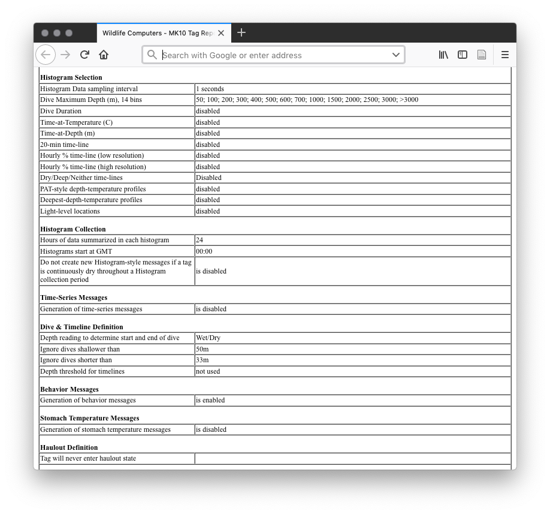

# MK10 Host

## Recording Settings

It is sometimes nice to have a table of all of the settings for a large number of tags. There is not a great way to do this. I recently asked if Wildlife Computers would be willing to share the specifications on the wch file format so that I could read in the settings automatically. They were not willing to share this. Without a specification, it would be very time consuming to parse the wch files.

Instead there is an option in MK10 Host to output an html file which is called a settings report (usually actually with an htm extension). This file is a massive html table with most of the settings and is somewhat easier to parse.

<div class="figure">

<p class="caption">(\#fig:settings-report)Partial example of an html settings report for a SPLASH10 tag</p>
</div>

I've written a bit of code to try to parse these automatically and put it in the `sattagutils` package (§ \@ref(sattagutils)). The relevant function is `sattagutils::wch_html2df(dir, file)`. It takes as parameters a directory path of htm files or a single htm file to convert to a `data.frame` which it returns. I try to do the minimum processing at this step, though I change commas to semicolons and otherwise remove characters that would be illegal in an R `data.frame`. The result can be further processed and saved.


``` r
config_df <- sattagutils::wch_html2df("examples/configs")
dim(config_df)
```

```
## [1]   2 133
```

``` r
# take a peak at some fields
knitr::kable(config_df[, c(
  'wch_filename',
  'Tags_Serial_Number',
  'PTT',
  'Ignore_dives_shallower_than',
  'Ignore_dives_shorter_than'
)], booktabs = TRUE)
```


|wch_filename                |Tags_Serial_Number |PTT    |Ignore_dives_shallower_than |Ignore_dives_shorter_than |
|:---------------------------|:------------------|:------|:---------------------------|:-------------------------|
|Example1-53643-15A1024.htm  |15A1024            |53643  |50m                         |33m                       |
|Example2-174749-17A0528.htm |17A0528            |174749 |75m                         |30s                       |

There are some irregularities in the html configuration files including some typos. When these are fixed the `wch_html2df` function will break. In addition, some settings change their label when turned on or off or disappear completely to be replaced by other options.

One note about generating the settings files in general: They can be generated both from a real tag plugged into MK10 Host, but also after the fact from wch files. Importantly, when generated from wch files, they do not retain the calibration information on the various sensors.

<div class="figure">

<p class="caption">(\#fig:settings-report-channels)An example of the sensor calibration section of an html settings report generated from a wch file as opposed to from a real tag.</p>
</div>

If an html report is not made from the physical tag for deployment as far as I know these data are lost (as in the image above). It is possible that Wildlife Computers keeps records of the calibrations and could send them upon request for particular tag serial numbers, but I do not know.

## Detailed settings descriptions and comments

### Host Settings {#hostsettings}
MK10Host version
: This is the windows software that connects to and programs the tag.

User Name
: This is the username of the person who generated the configuration report. This might be the person who programmed the tags or might also be generated after the fact by someone else from the wch file.

### Time and Date Settings
PC Date UTC
: Date and time of report generation.

Tag Date
: Date and time on tags clock.

PC UTC offset
: Time difference from PC local time to UTC.

### General Settings
Tag's Serial Number
: This is a identifier of the tag. Not to be confused with the PTT.

Password
: Mostly this is MK10, occasionally something else. If you can't figure it out for a tag check with the programmer (usually you can figure out who that is from the [**username**](#hostsettings)).

User's Identifier
: This is a user inputted name for the tag. E.g., "Zc" would be a tag set up to be deployed on a *Ziphius cavirostris*. This will not be the DeployID because it is set before tags are deployed and the DeployID isn't necessarily known beforehand.

Argos Ptt number
: PTT is the Argos platform terminal transmitter (See Argos user manual section 4.1). In our case this is embedded in a tag.

: The first decimal number is how CLS identifies the tag on their web portal. The second hexadecimal number in parenthesis is what the transmitter actually squawks. This is, for instance, exclusively the number we get from the goniometer (§ \@ref(goniometer)). These two numbers could be related in some predictable way to each other, but if they are I can't tell...

: LUT stands for the local user terminal. LUTs download data from satellites and are how we get anything back at all from Argos.

Repetition Intervals
: This is set to 15s (at-sea) for all tags. This is the interval at which the tag will send another Argos message when dry.

Number of Argos transmissions
: If the report was generated with a tag actually connected during programming this will be the actual cumulative number of Argos transmissions at that time. This is often in the several hundred range, because wildlife computers will run the tag before delivery and the programmer or others may run the tag for brief periods for the purposes of testing. If the report was generated after the fact from a configuration file and not the actual tag this field will read 0.

Tagware version
: 

Hardware version
: 

Battery Configuration
: A description of the number and type of batteries. This depends on the tag. For example, 2 x M3.

Battery Capacity
: For example, 1500mAh.

Battery is not classified as dangerous goods
: This is shipping / export info.

Deploy from Standby on Depth Change
: This is set to 'no' on our tags.

Owner
: It looks like this is usually the wildlife computers address for some reason.

Bytes of archive data collected
: As above, if the real tag is connected this will read how much data has been stored to the onboard memory. If the report is generated form a configuration file this will read 0.

Bytes of histogram and profile data collected
: As above, if the real tag is connected this will read how much data has been stored to the onboard memory. If the report is generated form a configuration file this will read 0.

### Data to Archive Settings

NOTE: these settings are tricky. Most of them should not matter since we never recover the archive. Status messages pull data directly from the sensors, so should not be dependent on any of these sampling periods. However, Wildlife Computers technical staff has indicated that these settings are used by the tag to determine how to sample for some of our data streams. In particular Depth and wet/dry appear to be important. Apparently there is a hack to get a faster wakeup to the tag by decreasing the sampling period for wet/dry but we have not tested this.^[SPLASH10 tags have a 1/2 second wake up time, while SPOT6 have a 1/4 second wake up. By increasing the sampling rate, we can hack the SPLASH10 to have a 1/4 second wake up at the cost of power. Is this because it is actually logging at that higher sampling rate? I'm not sure.]

Depth
: 

Internal Temperature
: 

External Temperature
: 

Depth Sensor Temperature
: 

Battery Voltage
: 

Wet/Dry
: 

Wet/Dry Threshold
: Most tags are set to Dry if > 150. The conductivity sensor reports 8 bit resolution. This is an empirical value determined by Cascadia and perhaps others to be effective. Wildlife Computers has an dynamic threshold algorithm, but early tests by Cascadia and others found it to be unsatisfactory. It is possible that algorithm may have been updated to function better now, but since this threshold appears to be working adequately we have not changed it.

Sampling Mode
: Set to wet or dry.

Automatic Correction of Depth Transducer Drift
: Set to Using first dry reading on most of our tags. The other option is by most common shallow depth; this is for sharks. This means the pressure transducer is read when the tag becomes dry and can apply a correction if this reading is not 0. Wildlife Computers technical staff indicated that this correction is only applied 1 meter at a time (on 2000m tags) and the correction will only be applied to +/- 40m.

### Data to Transmit Settings
Histogram Selection
: All of the histograms have been disabled for the latest BRS tags. Our goal is to get continuous dive record either through the behavior summary data or the series data and so any histogram of dives are not useful. They serve as a reduced representation of the dive record in the case where you wouldn't expect to get continuous records. The dive histograms can of course be calculated from our behavior records. Since we have not been thinking about or using any kind of temperature data we have also left this off.

Histogram Data sampling interval
: 

Dive Maximum Depth (m)
: 

Dive Duration
: 

Time-at-Temperature (C)
: 

Time-at-Depth (m)
: 

20-min time-line
: 

Hourly % time-line (low resolution)
: 

Hourly % time-line (high resolution)
: 

Dry/Deep/Neither time-lines
: 

PAT-style depth-temperature profiles
: 

Deepest-depth-temperature profiles
: 

Light-level locations
: 

### Histogram Collection

Hours of data summarized in each histogram
: 

Histograms start at GMT
: 

Do not create new Histogram-style messages if a tag is continuously dry throughout a Histogram collection period
: 

### Time series messages

Generation of time-series messages
: 

Time interval between TS samples
: We selected 5 minute period for our test tags. This was based on average *Z. cavirostris* dive times for shallow and deep dives while minimizing the number of messages per day. Each time series message contains 48 points, so a higher sampling frequency will result in more messages generated per day. The options are 1.25, 2.5, 5, 7.5, and 10 minute sampling periods. Generating 24, 12, 6, 4, and 3 messages per day respectively. See § \@ref(seriestags) for details. 

Channels sampled
: We have set this to just depth for the BRS test series *Z. cavirostris* tags. Can also sample temperature. That would double the amount of data transmitted.

Start with
: This is an initial number of days to collect time-series data for. We've set this to 14 days for the BRS test series tag configuration. This way it doesn't matter when the tag turns on from that point onward it'll record for 14 days and then duty cycle.^[It doesn't seem to ever be exactly 14 days, I don't know how it counts...]

then Duty Cycle with
: We've set this to 0 days off.

and
: We've set this to 0 days on.


### Dive and Timeline Definition

These settings determine what qualifies as a dive.

Depth reading to determine start and end of dive
: We have been typically setting this to wet or dry. There is a risk that if the conductivity sensor is low or fouled or the weather is high that surfacings will be undersampled. See § \@ref(undersample) for a more detailed discussion of this issue. While this determines what is a candidate dives it must also pass the following tresholds to be saved as a dive and put in the buffer for transmit.

Ignore dives shallower than
: We've set this to be 50 meters for *Z. cavirostris* and 75 meters for *G. macrorhynchus*. The maximum is 75 meters.

Ignore dives shorter than
: We've set this to be 33 minutes for *Z. cavirostris* and 30 seconds for *G macrorhynchus*. (see § \@ref(behaviortags) for details)

Depth threshold for timelies
: 

### Behavior Messages

Generation of behavior messages
: 

### Stomach Temperature Messages

Generation of stomach temperature messages
: 

### Haulout Defintion

There is only one field under this heading and the label changes depending on what is set. For cetaceans, you generally do not set this and so it'll read **Tag will never enter haulout state**.

### Transmission Control {#buffer}

Transmit data collected over these last days
: This is what we call the [buffer](#gloss). This seems simple but it is tricky. The Argos platforms transmit only, they have no idea if a satellite receives anything. In fact they don't even know if a message is corrupted or not (for example, by water splashing the antenna and interrupting a transmission). The tag only knows whether or not a transmit was attempted. Therefore, the buffer allows some storage of messages so they can be transmitted several times over the course of a few days to increase the likelihood that they will get through the satellite.

: If the buffer is too short, then messages will be deleted before they have an opportunity to be transmitted successfully. If we have about 9% satellite coverage off the coast of North Carolina, then a message should have to be sent about 10 times for 1 to go through.

: If the buffer is too long, our probability of new messages being successfully transmitted goes down. In this example, in the beginning of the deployment the queue will be short because the tag hasn't been attached long enough to generate enough messages. So given a constant number of opportunities (the animal brings the tag to the surface) there will be more attempts per message. As the deployment goes on the message queue will get longer and longer and there will be fewer and fewer attempts for each message, especially impacting the latest messages which entered the queue when there were already a lot of messages.

: So the key considerations are: data volume (settings dependent), satellite coverage (location dependent), and transmit opportunities (species and settings dependent). Other crucial settings are the transmit budget (§ \@ref(transmit-budget)), transmit duty cycle (§ \@ref(transmit-days)) and collection duty cycle (§ \@ref(collect-days))

: Cascadia's experience has been that for deep diving cetaceans a **2 day** buffer works well for collecting behavior data and tends to baa lance the above concerns. For our series tag configurations (see § \@ref(seriestags)), we used a **100 day** buffer, the maximum, because we were most concerned with successfully receiving all records and adjusted other settings to increase this probability.

### Collection days {#collect-days}

January - December
: Which days to collect data on. For BRS, we have set these to all of the days. This is a way to duty cycle the tag off for specific days.

### Relative transmit Priorities

Histogram, Profiles, Time-lines, Stomach Temperature
: 

Fastloc and Light-level Locations
: 

Behavior and Time-Series
: 

Status
: Set to every 20 transmissions. I don't think this can be changed?

### When to Transmit Settings {#transmit-days}

Initially transmit for these hours regardless of settings below
: We've set this to 24. This comes from Cascadia. I assume the reason is to aid in determining if the tag is working properly and the deployment is OK.

Transmit hours
: This is based on an analysis of a satellite availability conducted by the tagger. For BRS, we have increased transmit hours to times when there is very poor or no satellite coverage but there is a possibility we will be offshore. We can use the goniometer (§ \@ref(goniometer)) to track animals as well as capture transmitted messages.

### Transmit Days

January - December
: Same as above for collection, but for transmission.

### Daily Transmit Allowance {#transmit-budget}

January - December
: Can only give one number per month which will apply to every day in that month. We've been using **700-750** for *G. macrorhynchus* and **470** for *Z. cavirostris*. In both cases we've set to **not accumulate** and **not optimize for battery life**. These numbers have been tested as effective by Cascadia.

: Some things to consider for transmission number include animal activity patterns, satellite coverage, and battery life. Transmissions use battery, so setting this number very high could lead to early battery drain. In the case of *Z. cavirostris* this is unlikely since they spend little time at the surface they generally do not hit the 470 transmit limit. *G. macrorhynchus* however can spend hours logging at the surface and may go through their entire transmit budget relatively quickly. Making this number smaller helps avoid the situation where the animals are spending a lot of battery life but not sending very informative data (not moving quickly or diving very much). The drawback to making this number small is that it may be used up before good satellite windows during the day.

### Channel Settings

These settings pertain to the sensors and their calibrations.

### Depth

This field also indicates if the tag is extended depth or not by looking in the value of the field under **Range** and **Resolution**.

Correction factors
: 

Errors
: 

Compensation factors
: 

Errors
: 


### Internal Temperature

Correction factors
: 

Errors
: 

### External Temperature

Correction factors
: 

Errors
: 

### Depth Sensor Temperature

Correction factors
: 

Errors
: 

### Battery Voltage

### Wet/Dry

