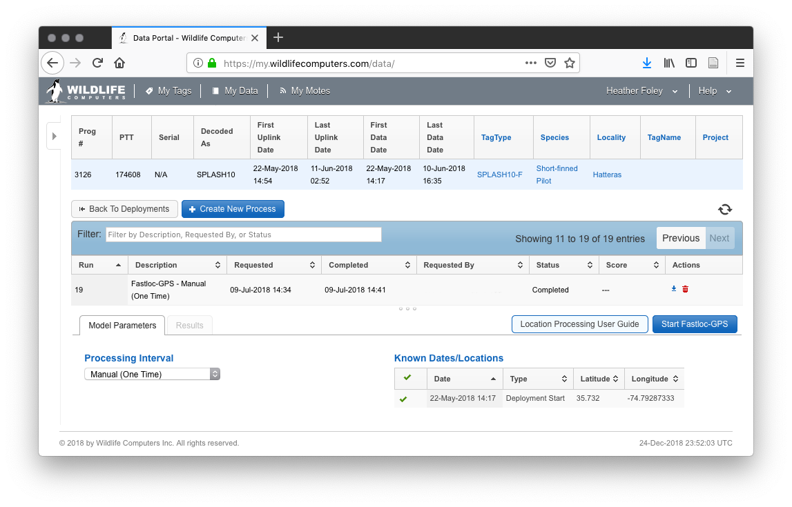
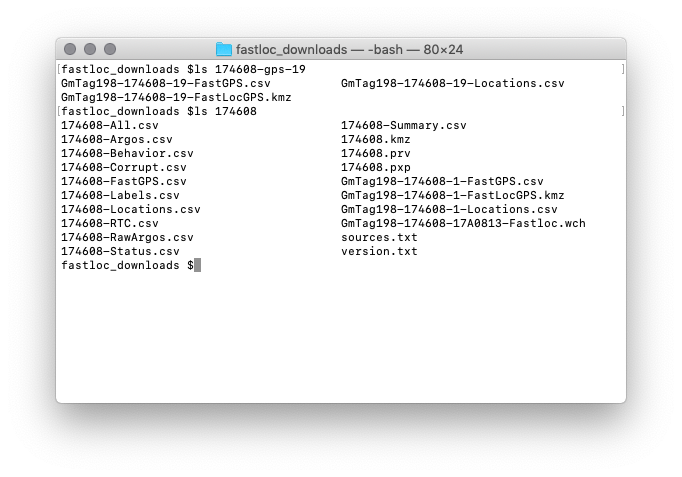

# Data streams {#datastreams}

The Wildlife Computers documentation (see § \@ref(resources), in particular the spreadsheet file descriptions) does a decent job of explaining the data in most of these streams. I've collected some notes here that aren't documented or where the documentation is confusing.

In addition, I've pointed out where some of the csv files for the data streams are not well formatted and so they may cause problems if you are trying to ingest them into your database. This was the main motivation for writing [`sattagutils`](#sattagutils).

## Date formats
- %m/%d/%Y %H:%M:%S
    - \*-All.csv: **Loc. date**, **Msg Date**
- %H:%M:%S %d-%b-%Y
    - \*-Behavior.csv: **Start**, **End**
    - \*-Corrupt.csv: **Date**, **Possible.Timestamp**
    - \*-SeriesRange.csv: **Start**, **End**
    - \*-Status.csv: **Received**, **RTC**
    - \*-Summary.csv^[I've never seen **ReleaseDate** and **DeployDate** so I'm not sure if they are implemented in the same way or not.]: **EarliestXmitTime**, **LatestXmitTime**, **EarliestDataTime**, **LatestDataTime** 
- Time (%H:%M:%S) and date (%d-%b-%Y) in separate fields
    - \*-FastGPS.csv: **Time**, **Day**
    - \*-RTC.csv: **TagTime**, **RealTime**; **TagDate**, **RealDate** 
    - \*-RawArgos.csv: **PassTime**, **MsgTime**; **PassDate**, **MsgDate**
    - \*-Series.csv: **Time**, **Day**

## Malformed

There are minor things to watch out for in all of the data streams including inconsistent capitalization schemes and field names with lots of whitespace and other odd characters.

A couple streams in particular are saved by default into files with the csv extension, but they aren't proper csvs.

### \*-RawArgos.csv

This stream always has 4 lines extra lines at the bottom which aren't part of a csv. 2 blank lines are followed by 2 line (1 header) table with PTT, Diags, Passes, and Msgs. If you're trying to load this file into R as a csv you'll get an error.

### \*-FastGPS.csv

This stream has 3 blank extra lines before the header at the beginning. Again you can't load this file straight into R as a csv without an error.You also often get multiple versions of \*-FastGPS.csv in a directory downloaded from the portal (see § \@ref(fastlocstreams) for details).

Instead of **DeployID** and **Ptt** this stream uses **Name**. I believe it defaults to **DeployID** unless none is present in which case it displays **Ptt**. This is the general behavior of **DeployID** as far as I know actually.

In addition if decoding with DAP / Argos Message Decoder and there are multiple tags in a PRV file, each new tag will include the 3 blank lines and header in the middle of the csv.

### \*-Labels.csv

There is something wrong with this file. I think it be missing an EOF or something? It is also a tall table instead of a wide table (like every other stream).

## Field details

### \*-Behavior.csv

Start / End
: These times are actually a little confusing. To understand them, recall that blocks of summary information about 'dives' and 'surface' behavior events are collated into a single 'message' for uplink to Argos satellites. The start and end times are not actually recorded on a clock for any of these behavior events. Instead something like a running count of seconds since the start of the message block (which is a clock time) is uplinked and then everything is converted back to clock time for the csv file output. I think this is a method to save space and make the messages smaller since Argos bandwidth is limited. This would all be fine, however, the start time of the message is recorded without seconds ^[I think they are rounded, but it is a little hard to tell.]. 

: This is a big deal. The start time of a message is only recorded to minute accuracy. All events within a message block are recorded to second accuracy (in number of seconds since the start of message) but the clock times reported in the behavior csv are off by an unknown and variable amount of seconds. This is troublesome if you are looking at coordinated behavior among multiple animals. It can also lead to overlapping times when a new behavior event starts (at the beginning of a message block) before the previous one ends (at the end of the preceding message block) ^[Another case of overlapping message blocks occured from a corrupt message which apparently wasn't caught by the decoding software. This produced one extremely long message which overlapped with many others in time. We also sent some overlapping *G. macrorhynchus* behavior records to Wildlife Computers but have not heard back. I am not sure if these were just the result of clock inaccuracy or not.].

DepthMax / DepthMin
: These are confusing because they both actually refer to an estimate of the maximum depth on a dive. The tag is actually sampling at some rate specified in the settings (we've been using 1 second) and using that data to generate the summary information about dives that ends up in the behavior stream. The sampled value for the maximum depth on a dive is encoded for upload to satellite and in that process some resolution is lost. So $DepthMax - DepthMin$ is the error band for the real maximum depth. Note that this is just error in the sense of resolution of the data encoding, it doesn't actually have anything to do with the measurement error in the pressure transducer. There is more chitchat about this in § \@ref(behaviortags).

DurationMax / DurationMin
: I do not know how these are generated, but I would like to know.

### \*-Series.csv

DRange
: the +/- error on the series depth ^[I assume **TRange** is the same but do not know for sure.]. This is confusing because it is called DRange which I assume stands for depth range and the text in the docs is ambiguous ^[See page 22 of Spreadsheet-File-Descriptions.pdf (§ \@ref(resources))]. So to calculate the actual error band it would be $2 \cdot DRange$. This is error in the sense of resolution of the data encoding, it doesn't actually have anything to do with measurement error in the pressure transducer. There is more chitchat about this in § \@ref(seriestags).

### \*-Status.csv

Note an important difference between the standard and extended depth pressure transducer configurations on SPLASH10 tags. The standard tags have a 0.5 meter resolution and report **Zero Depth Offset** in counts, so 30 counts is actually 15 meters. This is processed out in the \*-Behavior.csv depth fields as well as the **Depth** field in the \*-Status.csv. Confusing?

Zero Depth Offset
: is applied only 1 (count / meter?) at a time and only goes up to +/- 40 (count / meter?). At drifts greater than this, no offset is applied (and so if you were just looking at offset it would look like everything is normal with the transducer (See § \@ref(failures)).

Type
:  indicates whether a status message has passed a CRC (cyclic redundancy check; an error checking mechanism). If the value in this column is 'CRC' then the message did in fact pass the CRC. If the value is blank then there was no CRC, but the message is not necessarily corrupt. If a message fails CRC it is actually put in the \*-Corrupt.csv stream. Probably the most common reason for this is the transmission was interrupted by water splashing on the antenna (or the animal submerging). Note also that messages which pass CRC can still be corrupted in different ways.

: Between 2016 and 2017 an error was corrected which was causing too few status messages to come through. For example, prior to 2017, number of transmits never came through on a CRC message only on messages with a blank value in the type field. It is still true that the frequency different fields in status are populated varies from field to field.

## Fastloc streams on the portal {#fastlocstreams}

There are a couple of ways to set up Fastloc position solving on the Wildlife Computers portal. We have generally selected the "manual" option. This means that solved positions are not automatically incorporated into the platform (tag) archive under my data on the portal (with an exception as we'll see below). The \*-FastGPS.csv data stream is updated with the latest ids and ranges, but these are not solved.

(\#fig:download-fastloc)Example of how to download the main data archive for a fastloc (SPLASH10-F) tag on the Wildlife Computers portal.

To initiate a solve click on location processing and create new process. The results of which you can see below. If we wanted to set up an automatic location processing schedule we could select on the drop down menu.

(\#fig:solve-fastloc)Location processing interface on the Wildlife Computers portal.

You can see in this example that we've already requested the locations to be solved 19 times. Downloading this run of the solver will produce an archive with three files in it. And you'll notice a slightly different naming convention which includes the number of the solving run.

(\#fig:solve-fastloc-contents)Archive contents from an archive of solved positions downloaded from the location processing interface on the Wildlife Computers portal.

These files are not automatically transferred to the general archive on the main screen of my data on the portal except for the very first solve ^[Since we've always been using the manual download setting I don't know if this is generally true or only true for manual solving.]. Here is what that archive looks like for this tag:

(\#fig:unnamed-chunk-1)Comparison of archive contents of data downloaded from location processing interface (top) and the main my data interface (bottom) on the Wildlife Computers portal.

So between the two archives we actually have three copies of \*-FastGPS.csv, \*-FastLocGPS.kmz, and \*-Locations.csv and all have different contents. Care must be taken, therefore, when downloading data from the portal for fastloc tags, especially if you'd like to ingest them into a database.

