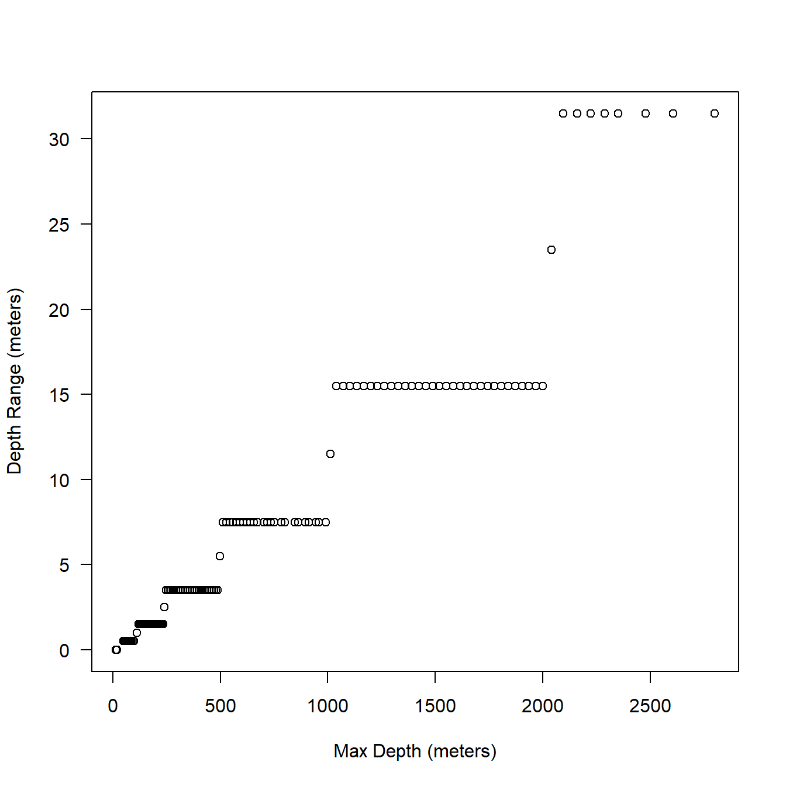
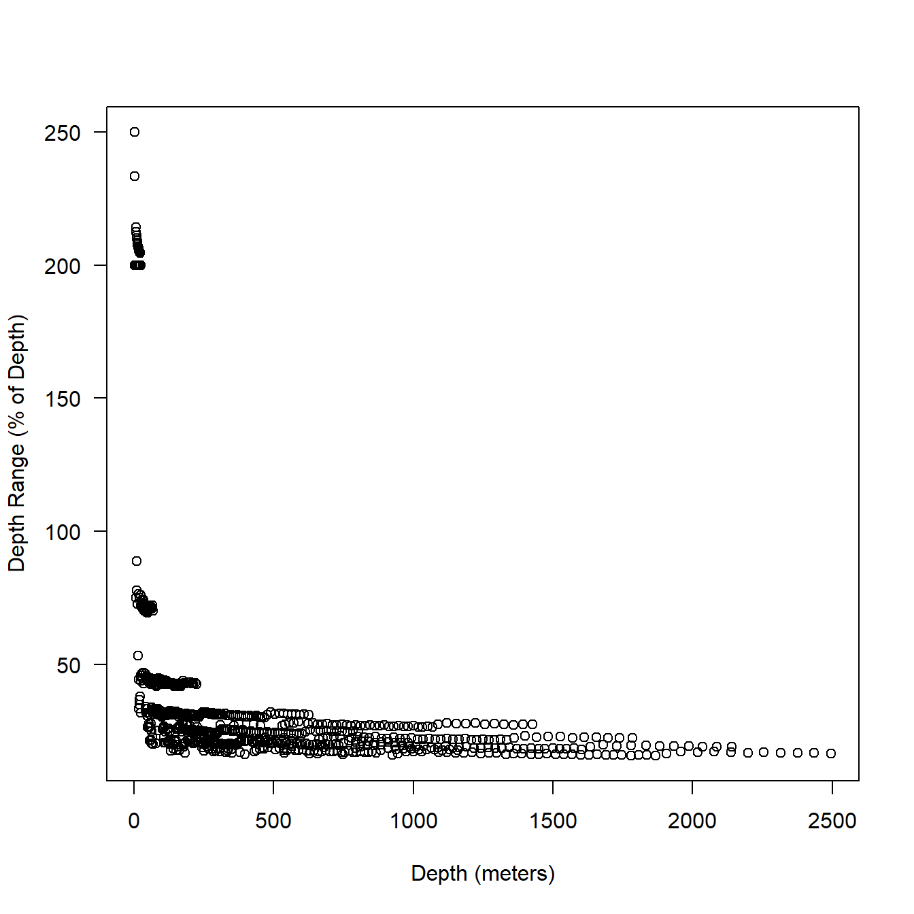
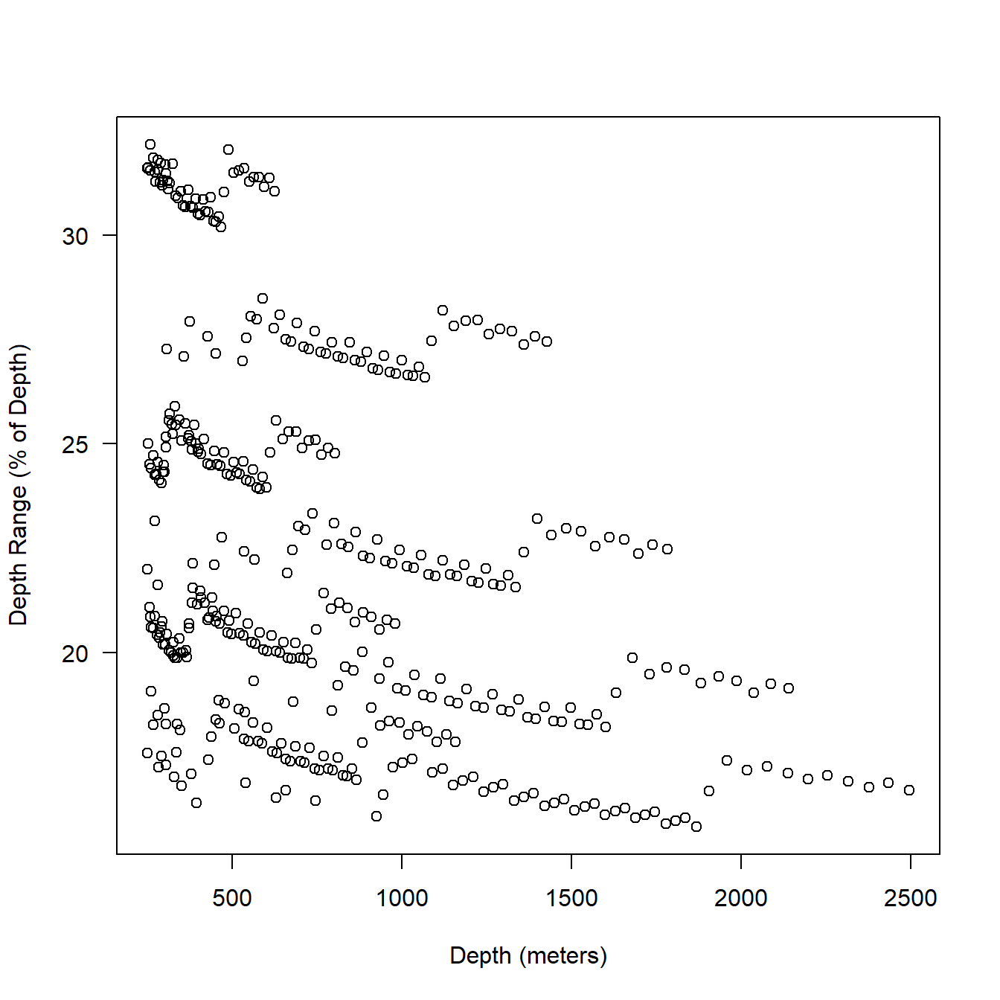
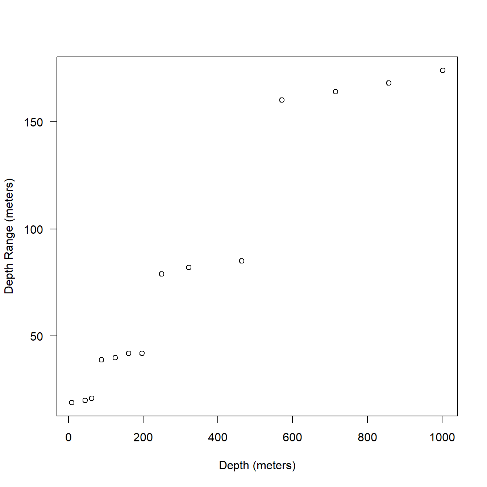
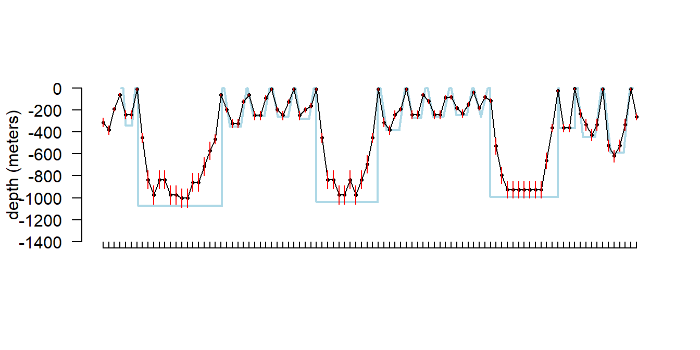

# Settings regimes

## BRS style behavior {#behaviortags}

@quick2019mind covers how and why we set the BRS behavior tags for *Z. cavirostris*. I'll provide only a very brief summary here. Also I have some chitchat about the depth resolution because it is relevant for comparisons with the series only tags (see § \@ref(seriestags)).

### Key settings
- We turned off all data streams we could besides behavior to limit the number of extraneous messages generated per day. Mainly this consisted of getting rid of histograms.
- Start and end of dives was defined by the conductivity sensor.
- For *Z. cavirostris*, we set a 33 minute, 50 meter dive minimum. This should correspond to approximately the 800 meter dive cut off (foraging dives).
- For *Globicephala macrorhynchus*, we set a 30 second, 75 meter dive minimum. This was the maximum dive minimum depth available.

### Benefits
- More complete behavior records (it worked really well!)
- Longer continuous stretches of behavior

### Costs and risks
- Battery usage? Hard to tell. I'll look into this more.
- Reduced dive data resolution (i.e., no shorter duration dives).

### Behavior data depth resolution {#beh-dep-res}

I'll use the two example tags to peek at the resolution of max depth on the behavior data stream. These are baseline *Z. cavirostris* tags so they include a variety of depths (not just dives over 33 minutes in duration). Depth range is really the bin width or resolution due to the encoding of the data and not the accuracy of the pressure transducer. Why did Wildlife Computers put an expensive pressure transducer accurate to 1 meter in the tag but always report coarser resolution? One answer is the higher resolution depths are recorded on the archive on board the tag, we just don't happen to usually get tags back with cetaceans. The other answer is to save bandwidth when transmitting data.

Fig. \@ref(fig:dep-deprange) sort of makes sense. The resolution becomes coarser as you go deeper and there seems to be a step function at consistent breaks.


```r
extags <- sattagutils::batch_load_tags("examples/tags")
beh <- sattagutils::getstream(extags, "behavior", squash = TRUE)
dives <- beh[beh$What == 'Dive', ]

dep <- apply(dives[, c('DepthMax', 'DepthMin')], 1, mean)
deprange <- (dives$DepthMax - dives$DepthMin)/2

plot(dep, deprange,
  xlab = "Max Depth (meters)",
  ylab = "Depth Range (meters)",
  las = 1
)
```

<div class="figure">

<p class="caption">(\#fig:dep-deprange)Relationship between max depth (behavior data) and bin resolution in meters.</p>
</div>

We can also graph this as percent of max depth which might make more sense. You can see in Fig. \@ref(fig:dep-deprange-percent) it looks like the depth bins (resolution) were designed to keep the error somewhere between 1-3% of max depth. That's OK that makes sense.


```r
plot(dep, (deprange/dep)*100,
  xlab = "Max Depth (meters)",
  ylab = "Depth Range (% of Max Depth)",
  las = 1
)

abline(h = mean(deprange/dep)*100, lty = 2)
```

<div class="figure">

<p class="caption">(\#fig:dep-deprange-percent)Relationship between max depth and bin resolution expressed as percentage of max depth. Broken line shows mean depth range.</p>
</div>

## BRS style series only tags {#seriestags}

The bandwidth limitations of non-recoverable satellite-linked biologging instruments in combination with the behavior of infrequent surfacers such as Ziphiids produce tradeoffs between data record length (longevity), data detail (resolution), and data gaps (completeness).

The relative importance of these three tradeoffs will depend on the research questions being addressed by biologging data in a particular study and an equal maximization function may not always be desirable. For example, in the baseline data collection off Cape Hatteras, SPLASH10 instruments were programmed to prioritize longevity and data resolution. Specifically, multiple data streams were collected at relatively fine sampling rates, and data collection was duty cycled to increase deployment length, necessarily introducing data gaps. During BRS, to ask if MFAS disrupts deep foraging dives, settings were chosen that prioritized long duration and complete records at the cost of resolution, i.e., shallow dives were not recorded [@quick2019mind].

While the BRS behavior tags were very successful in producing continuous records, there was a desire for higher resolution on *Z. cavirostris*. We turned to the series data stream as a possible alternative. Typically, series data had been duty cycled on our baseline tags and turned off for BRS tags to save message bandwidth. In this tag configuration, we turned off behavior data collection and transmission and only collected series data ^[I'm currently preparing a manuscript describing this setting configuration in detail and comparing series derived dive metrics to those derived from other data collection regimes. Whitepaper: https://osf.io/k8p94/].

<div class="figure">

<p class="caption">(\#fig:simant)A conceptual diagram showing the trade offs among data record length (longevity), data detail (resolution), and data gaps (completeness) and the strengths and weaknesses of each of three tag setting regimes for *Z. cavirostris*: (a) baseline (pre-BRS) (b) BRS behavior tags which recorded only dives over 33 minutes in length, and (c) the series only tag configuration described here.</p>
</div>

### Benefits
- A true time series of depth including shallow dives
- No reliance on conductivity for start and end dive definitions
- Data can be down sampled to mimic behavior data for comparability with previous deployments
- Pressure transducer failures may be easier to diagnose

### Costs and Risks
- Tradeoff between sampling rate and risk for gaps. Higher resolution = more messages generated per day.
- Durations may be less precise than those defined by the conductivity sensor
- 16 depth bins based on minimum and maximum dive during each message = slightly different depth resolution from message to message and in general less resolution than behavior data (though note that behavior dive events only provide 1 depth per dive).

### Settings decisions

Based on the distribution of messages per day we get from behavior tags (see @quick2019mind), we settled on a series sampling period of 5 minutes. Each message contains 48 points so this period produces 6 messages per day. To limit gaps in the data we activated data collection for 14 days and then continued transmission while ceasing collection. We set a data buffer to 100 days (the maximum) with the hope that all gaps would back fill before the end of the tags life.

Since there is an interaction between animal behavior and satellite availability these figures are species specific as well as field site specific. We made educated guesses based on the performance of the behavior tags (§ \@ref(behaviortags)) to come to these figures^[Wildlife Computers does have a simulator to test tag configurations. It requires some seed data, but then will run the tag as configured through many simulated deployments and produce sample outputs which can be assessed. We did not avail ourselves of this service in this case.]. Ultimately, due to the large number of variables, a field test was required to assess the series tag performance. Nevertheless, I've included a bit of additional chitchat about sampling period below.

#### Sampling period

As mentioned above, we choose a 5 minute sampling period as a trade off between aliasing shorter dives and generating more messages than could reasonable be uplinked. We can take a look at the same dive profile at different sampling period from some of the baselines tags which we sampled at 2.5 minutes. Above 5 minute sampling periods aliasing becomes quite apparent (Fig. \@ref(fig:ser-alias)).


```r
# this function is currently missing from sattagutils (issue #12)
source("helper_functions/findgaps.R")
s2_5 <- sattagutils::getstream(extags[[1]], "series", squash = TRUE)

# just look at a couple of messages
s2_5 <- s2_5[1:(48*4), ]

# make downsampled versions for
# 5 min, 7.5 min, and 10 min sampling periods
s5   <- sattagutils::resample_ser(s2_5, 5)
s7_5 <- sattagutils::resample_ser(s2_5, 7.5)
s10  <- sattagutils::resample_ser(s2_5, 10)

# plot
par(mfrow = c(4, 1), mar = c(0.1, 4.1, 0.1, 0.1))
sattagutils::plot_series(s2_5, 
  ylim = c(-1100, 0), las = 1, xaxt = 'n', xlab = "", ylab = ""
)
legend("bottomright", legend = "period = 2.5 min; 12 msg / day", bty = 'n')
sattagutils::plot_series(s5,
  ylim = c(-1100, 0), las = 1, xaxt = 'n', xlab = "", ylab = "depth (meters"
)
legend("bottomright", legend = "period = 5 min; 6 msg / day", bty = 'n')
sattagutils::plot_series(s7_5,
  ylim = c(-1100, 0), las = 1, xaxt = 'n', xlab = "", ylab = ""
)
legend("bottomright", legend = "period = 7.5 min; 4 msg / day", bty = 'n')
sattagutils::plot_series(s10,
  ylim = c(-1100, 0), las = 1, xaxt = 'n', xlab = "", ylab = ""
)
legend("bottomright", legend = "period = 10 min; 3 msg / day", bty = 'n')
```

<div class="figure">

<p class="caption">(\#fig:ser-alias)Real series data collected on a baseline *Z. cavirostris* SPLASH10 tag is shown in the top panel and successively downsampled to represent other possible sampling periods in following panels.</p>
</div>

### Series data depth resolution

We can use the same tags as above (§ \@ref(beh-dep-res)) to take a peak at the depth resolution in the series data. In this case, though we aren't just looking at max depth of a dive but of a real time-series of depths at regular sampling intervals.

You can see in Fig. \@ref(fig:ser-dep-res) that the bin widths are substantially greater than for the behavior data. The odd fan pattern is actually created by the somewhat dynamic assignment of bins (based on min and max in a given message of 48 samples) and is explained further below.


```r
ser <- sattagutils::getstream(extags, "series", squash = TRUE)

plot(ser$Depth, ser$DRange*2,
  xlab = "Depth (meters)",
  ylab = "Depth Range (meters)",
  las = 1
)
```

<div class="figure">

<p class="caption">(\#fig:ser-dep-res)Relationship between depth (series data) and bin resolution in meters.</p>
</div>

When we look at percentages (Fig. \@ref(fig:ser-dep-res-percentage)), some are extremely high. Though, note that the very high percentages are all occurring at shallow depths. When the depth range is greater than 100% the mean depth is just 13 meters. Fig. \@ref(fig:ser-dep-res-percentage-zoom) shows a zoom for depths of 250 meters and above. The mean depth range is still 21% of reported depth here ^[Some preliminary analysis of tags which were simultaneously collecting both behavior and series data suggests that on average the series data actually performs better than these theoretical ranges when maximum depths are compared between series dive profiles and behavior dive events.].


```r
plot(ser$Depth, (ser$DRange*2 / ser$Depth) * 100,
  xlab = "Depth (meters)",
  ylab = "Depth Range (% of Depth)",
  las = 1
)
```

<div class="figure">

<p class="caption">(\#fig:ser-dep-res-percentage)Relationship between depth (series data) and bin resolution expressed as a percentage of depth.</p>
</div>


```r
plot(ser$Depth[ser$Depth >= 250], ((ser$DRange*2 / ser$Depth) * 100)[ser$Depth >= 250],
  xlab = "Depth (meters)",
  ylab = "Depth Range (% of Depth)",
  las = 1
)
```

<div class="figure">

<p class="caption">(\#fig:ser-dep-res-percentage-zoom)Relationship between depth (series data) and bin resolution expressed as a percentage of depth. Only depths 250 meters and greater are plotted.</p>
</div>

To understand how the 16 bins are set it is neccessary to look at one message at a time. Here I'll just take the first full^[Series messages are actually scheduled based on real time depending on the sampling period. That is at 5.0 minute period, messages always end at 00, 04, 08, 16, and 20hrs. Therefore, whenever the tag is deployed it typically sends a shorter first message, before ending on schedule and then being aligned with 48 sample messages from that point forward.] message of one our example tags. You can see below that there is still a sort of step function similar to what we saw in the behavior data in the bin widths but it is more complex here as there is some variation within each 'step' \@ref(fig:ser-dep-res-one-mesage)).


```r
t1 <- extags[[1]]
ser <- sattagutils::getstream(t1, "series", squash = TRUE)
msg <- sattagutils::getstream(t1, "seriesrange", squash = TRUE)

st_firstfull <- msg$Start[2]

ser2 <- ser[ser$Date >= st_firstfull]
ser_msg1 <- ser2[1:48, ]

plot(ser_msg1$Depth, ser_msg1$DRange*2,
  las = 1, xlab = "Depth (meters)", ylab = "Depth Range (meters)"
)
```

<div class="figure">

<p class="caption">(\#fig:ser-dep-res-one-mesage)Relationship between depth and bin resolution in series only data.</p>
</div>

I'll plot 10 messages together color coded by message on the same graph to see how the overall pattern is created in bin width and depth (Fig. \@ref(fig:ser-error-ten-msg)).


```r
cols <- rep(1:10, each = 48)

ser_10msg <- ser2[1:length(cols), ]

plot(ser_10msg$Depth, ser_10msg$DRange*2,
  col = cols, las = 1,
  xlab = "Depth (meters)", ylab = "Depth Range (meters)"
)
```

<div class="figure">

<p class="caption">(\#fig:ser-error-ten-msg)The first 10 full messages of one of our example series tags showing the relationship between depth and bin width (twice the DRange). Each color indicates a single message.</p>
</div>


It might be useful to plot these depth errors on a depth profile (Fig. \@ref(fig:ser-with-error)); we can use the same tag as above. This tag also happened to be recording simultaneous behavior data so we can superimpose the two data records to compare the different types of depth information (Fig. \@ref(fig:beh-ser-overlay)). Note that the behavior data is displayed as a dive profile but in truth it is only a sort of pseudo-dive profile ^[The shape of the dives here are just to indicate qualitative differences between square, U-, and V-shaped dives as reported in the behavior data stream.]. Depth error appears fairly negligible for shallow dives, but more substantial for the deeper dives.

It is worth noting that the series data in general appears to underestimate maximum depth on deep dives when compared to the behavior data stream. I believe this is because short forays (less than the sampling period) can be missed on the series data, but the max depth on the behavior data stream is actually logged from a 1 second (on our tags) sampling period, even though only one value and a range are retained per dive.


```r
sattagutils::plot_series(s5,
  ylim = c(-1100, 0), las = 1, xaxt = 'n', xlab = "", ylab = "depth (meters)"
)
axis(1, at = s5$Date, lab = NA, tcl = 0.3)
segments(s5$Date, -s5$Depth - s5$DRange, s5$Date, -s5$Depth + s5$DRange, col = "red")
```

<div class="figure">

<p class="caption">(\#fig:ser-with-error)An example series dive profile (5 min sampling period) with depth bin resolution indicated in red.</p>
</div>


```r
# this function is still being migrated into sattagutils
source("helper_functions/plot_dives.R")
b1 <- sattagutils::getstream(extags[[1]], "behavior", squash = TRUE)
overlap <- b1$Start >= s5$Date[1] & b1$End <= s5$Date[nrow(s5)]

plot_dives2(b1[overlap, ], 
  show_gaps = FALSE, legend = FALSE, 
  start_time = sattagutils::num2date(s5$Date[1]),
  end_time = sattagutils::num2date(s5$Date[nrow(s5)]), 
  pch = NA, col = "lightblue", lwd = 2
)

axis(1, at = s5$Date, lab = NA, tcl = 0.3)
points(s5$Date, -s5$Depth, pch = 16, cex = .5)
lines(s5$Date, -s5$Depth)
axis(1, at = s5$Date, lab = NA, tcl = 0.3)
points(s5$Date, -s5$Depth, pch = 16, cex = .5)
lines(s5$Date, -s5$Depth)

segments(s5$Date, -s5$Depth - s5$DRange,
  s5$Date, -s5$Depth + s5$DRange, 
  col = "red"
)
```

<div class="figure">

<p class="caption">(\#fig:beh-ser-overlay)Series dive profile (black) and behavior pseudo-dive profile (blue) superimposed for a tag that was recording both streams simultaneously. Red verticle segments indicate depth resolution for the series data.</p>
</div>

### In the field performance

I won't get into all the details here of in the field performance because we're still working on assessing it, but I will point out a couple of things. In general, the settings performed well despite some apparently unrelated tag failures. Several of the tags produced near perfect records. After 14 days of data collection it tended to take about another 10-14 days to complete transmission of those records, which brought the total tag close to the median SPLASH10 deployment survival time on *Z. cavirostris* of about 30 days. Fig. \@ref(fig:series-series-high) shows an animation of the message arrival pattern for a well performing tag, which was placed high on the dorsal fin^[Dorsal fin placement seems to be a major determinant of how many messages are successfully transmitted to satellite [see @quick2019mind]]. Fig. \@ref(fig:series-series-low) shows a similar plot for a poorer performing tag with a lower dorsal fin attachment. It was also noted in the field that this animal tended to surface low. Arrival of messages is slower for this tag and average number of times each message was received was also lower. Nevertheless, the majority of messages were ultimately received by satellite. These messages were also supplemented by those captured in the field using a boat based receiver (not displayed here, see § \@ref(goniometer)).

<div class="figure">

<p class="caption">(\#fig:series-series-high)Series message arrival pattern for a well performing tag with good placement. Data download date can be seen advancing above plot. Bars indicate how many times each series data message was received and pink areas indicate data gaps.</p>
</div>

<div class="figure">

<p class="caption">(\#fig:series-series-low)Series message arrival pattern for a low tag placement. Data download date can be seen advancing above plot. Bars indicate how many times each series data message was received and pink areas indicate data gaps.</p>
</div>

### Future directions

Some considerations for future series based tags include:

- Higher resolution w/ shorter collection interval
- Different buffer lengths
- Is depth resolution sufficient?

## BRS fastloc tags

What follows are just some very cursory notes on the fastloc tags (SPLASH10-F) used during BRS; we haven't looked at any of this in great detail. There was one fastloc equipped tag deployed before BRS [see @baird_report2017], but it was a sort of prototype and set up very differently from subsequent tags and I won't focus on it here. During BRS3, 3 fastloc tags were deployed on *G. macrorhynchus* and 2 fastloc deployed during BRS4, one on a *Z. cavirostris* and one on a *G. macrorhynchus*.

### BRS3 fastloc tags

#### Key settings
- 2 day buffer
- ignore dives shallower than 75 meters, less than 30 seconds
- high fastloc transmit priority / low behavior transmit priority
- max 2 fastloc per hour
- max 48 per day
- max 4 failed per hour
- max 96 attempts per day

#### Performance


Table: (\#tab:brs3-fastloc-beh-perf)Behavior data stream gap summary statistics. Gma = *Globicephala macrorhynchus*

              species   data record length (days)   number of data gaps   mean gap length (days)   summed gap length (days   proportion of data record gapped 
------------  --------  --------------------------  --------------------  -----------------------  ------------------------  ---------------------------------
exgpstag3_1   Gma       19                          20                    0.57                     79                        0.17                             
exgpstag3_2   Gma       11                          17                    3.33                     140                       0.52                             
exgpstag3_3   Gma       24                          39                    2.30                     274                       0.47                             


Table: (\#tab:brs3-fastloc-loc-perf)Location summary statistics including proportion of locations in each of the location quality classes. Gma = *Globicephala macrorhynchus*, lq = location quality.

              species   n days   lq = Z   lq = A   lq = B   lq = 0   lq = 1   lq = 2   lq = 3   total locations   locations per day 
------------  --------  -------  -------  -------  -------  -------  -------  -------  -------  ----------------  ------------------
exgpstag3_1   Gma       19       0.026    0.043    0.10     0.28     0.31     0.17     0.074    231               12                
exgpstag3_2   Gma       11       0.025    0.089    0.12     0.20     0.25     0.22     0.089    158               14                
exgpstag3_3   Gma       24       0.052    0.052    0.12     0.22     0.28     0.20     0.079    290               12                


Table: (\#tab:brs3-fastloc-fastgps-perf)Fastloc summary statistics. Gma = *Globicephala macrorhynchus*

              species   n days   n fastlocs   n fastlocs per day   mean number of sats tracked   mean time btwn fastlocs (hours) 
------------  --------  -------  -----------  -------------------  ----------------------------  --------------------------------
exgpstag3_1   Gma       19       443          23                   4.6                           1.03                            
exgpstag3_2   Gma       11       273          24                   5.2                           0.99                            
exgpstag3_3   Gma       24       287          12                   4.4                           2.14                            

### BRS4 fastloc tags

#### Key settings
- no behavior data
- otherwise similar to BRS3

#### Performance


Table: (\#tab:brs4-fastloc-loc-perf)Location summary statistics including proportion of locations in each of the location quality classes. Gma = *Globicephala macrorhynchus*, Zca = *Ziphius cavirostris*, lq = location quality.

              species   n days   lq = Z   lq = A   lq = B   lq = 0   lq = 1   lq = 2   lq = 3   total locations   locations per day 
------------  --------  -------  -------  -------  -------  -------  -------  -------  -------  ----------------  ------------------
exgpstag4_1   Gma       21       0.029    0.098    0.13     0.27     0.253    0.159    0.069    245               11                
exgpstag4_2   Zca       24       0.242    0.206    0.12     0.24     0.055    0.018    0.115    165               7                 


Table: (\#tab:brs4-fastloc-fastgps-perf)Fastloc summary statistics. Gma = *Globicephala macrorhynchus*

              species   n days   n fastlocs   n fastlocs per day   mean number of sats tracked   mean time btwn fastlocs (hours) 
------------  --------  -------  -----------  -------------------  ----------------------------  --------------------------------
exgpstag4_1   Gma       21       333          15.5                 4.7                           1.4                             
exgpstag4_2   Zca       24       182          7.7                  5.0                           3.1                             

