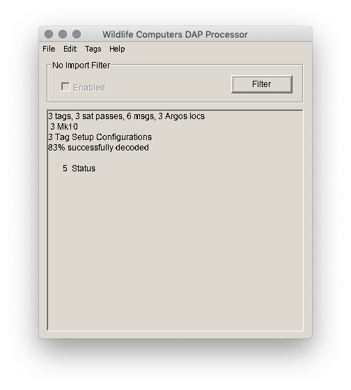
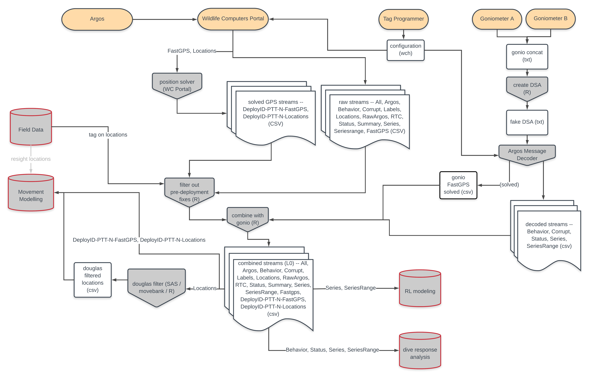
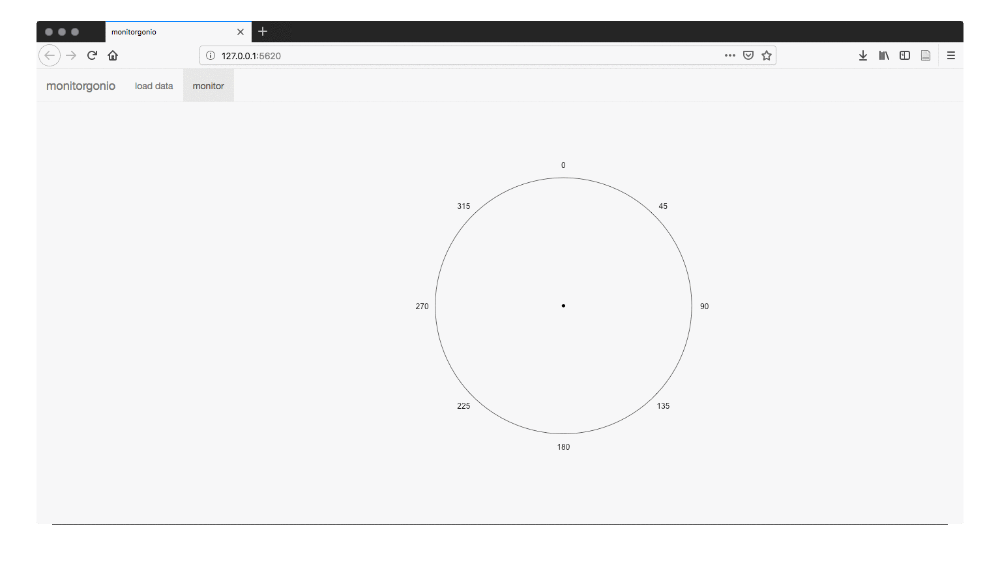
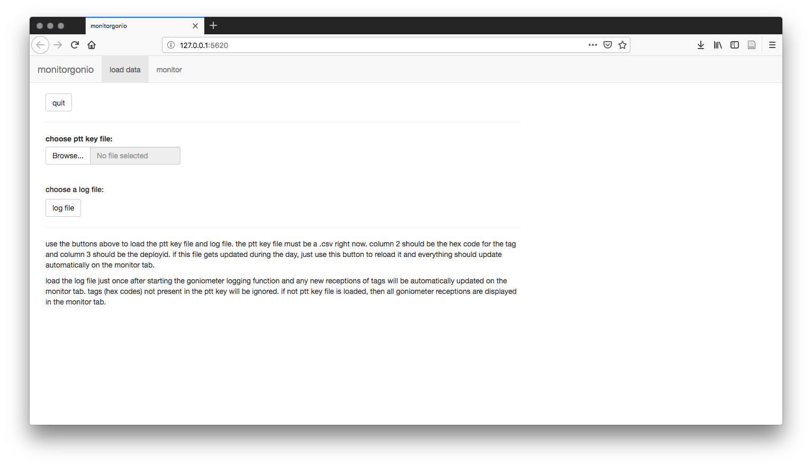
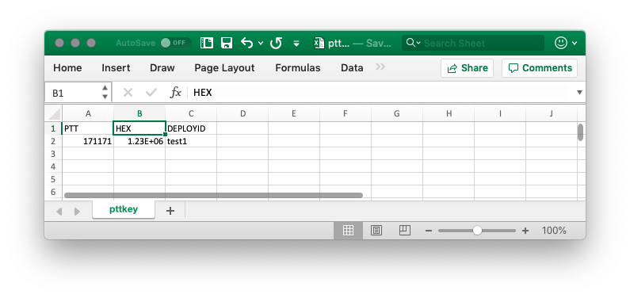
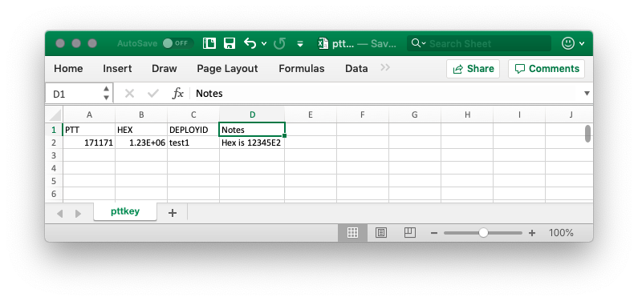

# Goniometer {#goniometer}

The Woods Hole Group (formerly CLS America) rents and sells an antenna and receiver that they call the [Argos Goniometer](https://www.clsamerica.com/argos-Goniometer). This machine can pick up and directionalize Argos PTTs and even downloads messages.

We set up our Goniometer to run in hyperterminal mode connected to a laptop on the boat. Basically this spits the Goniometer log out to a text file. There are a couple of different types of text that are displayed in that log but it is mostly comma separated values.

From the R/V Barber and an 3.4 meter mast for the antenna, we have perhaps a range of 4 miles at maximum. Occasionally there are odd atmospheric days that greatly increase range. From Carolina boats (charter boats) like the F/V Kahuna or F/V Hog Wild we get more like 7 miles range. Accuracy of direction readings increases with proximity.

## Good goniometers and bad goniometers

The goniometer comes in two main parts. The antenna and the receiver. We've never had an obvious problem with the performance of an antenna, and Wood's Hole Group technical staff suggests that problems generally arise from the receiver.

Below is a table of some of the antennas and receivers we've tested. All the serial numbers we've had have been in the form XXXX-3460313.

S/N  | Instrument | Function   | Condition | Notes                                | Owner  |
----:|------------|------------|-----------|--------------------------------------|--------|
0062 | Receiver   | Good       | Fair      |  GPS antenna plastic cracked^[Woods Hole Group technical staff suggests function should be unaffected]         | DUML   |
0059 | Antenna    | Good       | Good      |                                      | DUML   |
0108 | Receiver   | Good       | Good      |                                      | Rental |
0123 | Receiver   | Good       | Good      |                                      | Rental |
0060 | Receiver   | Bad        | Good      | poor signal / unreliable dir         | Rental |
Demo | Receiver   | Incomplete | Good      | no direction                         | Rental |
???? | Receiver   | Bad        | Good      | (BRS1) poor signal? / unreliable dir | Rental |
0135 | Antenna    | Good       | Fair      | crossthreaded                        | Rental |

## How to test a receiver

The simplest test of a reciever is to a turn on a tag briefly. This is best done outside and away from RF interference, but I've also just done it in the house and it has worked fine. When the tag is within a few feet of the goniometer the signal strength should be 0 (the strongest possible). Directionality can also be checked in this way by moving the tag in relation to the antenna noting the position of the nubbin which indicates 0° (forward).

A better test is with the antenna rigged onto the boat to walk around the boat the with a test tag transmitting to confirm signal strength and directionality. Again, you should be able to get the signal strength to 0 with this method. We've also tried leaving the test tag tansmitting on the dock and taking the small boat with a rigged antenna farther and farther away to do a simple range test. This can be tricky, because there are a lot of obstructions and interference near to shore. A better test could be performed at sea with two boats. It is also helpful to informally cross reference wich tags are being received between boats when there are multiple boats rigged with goniometers in the same general area tracking animals.


## Decoding Goniometer received messages

I've written some code to decode the Goniometer received messages. Really I didn't though, you still need [Argos Message Decoder.exe / DAP Processor]{#dap} to decode the messages, but my code transforms the Goniometer type output into something that DAP Processor can read.

Eventually this code will be wrapped into the [`sattagutils`](#sattagutils) package, but for now it lives in a separate github [repo](https://github.com/williamcioffi/parsegonio). Included in the repo is a full working example.

Goniometer log output usually looks something like this:

```
2017-05-02 14:42:07 : USB Connection to RXG134
2017-05-10 21:00:38 Received : $NPRF,7,17,5,10,21,0,24,0A1FBD4,401677726,7,109,115,-128,-128,-4486401,2133099,10,192,D4049D095018019931F7F4B00960508485440003B6567FC0*46
2017-05-10 21:00:58 Received : $NPRF,7,17,5,10,21,0,44,0A1FBD4,401677737,7,117,113,-127,-127,-4486412,2133177,2,192,D4040555502CF64C3207F4A009605084854000027FC00000*01
```

The $NPRF indicates that a platform has been favorited, but the log will also display messages from non favorited platforms with the label $NPR. The date, PTT, signal strength, bearing, among other things are recorded here. The last field is the data message.

You can use `parsegonio()` to create a simulated prv file that DAP processor can read:


```r
gfile <- "gonio_ex_log.txt"
pttkey_file <- "pttkey.csv"

source("parsegonio.r")
output <- parsegonio(gfile, pttkey_file)
cat(output, file = "gonio_output.prv")
```

`parsegonio()` takes two parameters: `pttkey_file` is a csv which includes the PTT, hex, and DeployID of platforms of interest (only the PTT and hex are necessary) and `gfile` is an example Goniometer log.

I've saved the output to gonio_output.prv here. It seems like there is some flexibility in the prv format and I've taken some liberties, mainly because I don't entirely understand every part of the format. In my simulated prv, for each platform, all the messages from the Goniometer log are lumped under one satellite pass even if they occurred over many days. This isn't realistic, but DAP Processor doesn't seem to mind and satellite passes don't mean anything in this use case anyway. In addition, real prv files include the solved Argos position. Obviously I don't have one, so I just added a point right outside Pilkey.

Once you have the simulated prv output you can just drag it into DAP processor. It helps to have preloaded a workspace with wch files as well as DAP will use the tag settings during decoding, though you can still get something even without them.

<div class="figure">

<p class="caption">(\#fig:dap-window)The example goniometer messages included in parsegonio decoded by Argos Message Decoder.exe / DAP Processor</p>
</div>

csv files can now be exported. Aome of these for instance, \*-Locations.csv, \*-Argos.csv will be complete junk. Others will mostly make sense, but be sure to ignore anything to do with Dopler locations or satellite passes.

### Locations and FastGPS
While the Goniometer received messages do not provide Doppler positions there are two ways in which they may assist with real locations.

The first way we can more positional information, from Rob Schick, is to use Goniometer bearing to constrain the error ellipses on Doppler positions. See Rob's figure [here on the osf](https://osf.io/2mny3/).

The second way we can get additional positions is with the FastGPS messages. These messages consist of time and range information for GPS satellites, which are later solved (serverside) for positions. We can use [DAP / Argos Message Decoder](#dap) to solve these positions after the fact even from Goniometer received FastGPS messages. If some of these messages were never received by the satellite then they represent added location data. Care must be taken, however, when thinking about the init locations. DAP / Argos Message Decoder decides which recent location is the best to use as an init and if there is nothing better recently it will use a Argos Doppler position, even a low quality one. Since I've simulated the `prv` file with a fake Doppler position, the FastGPS solver will sometimes use this to seed locations. I have not investigated in detail the consequences of this and have not assessed the accuracy of these positions, but it is on the list.

I can think of a couple of solutions to make these FastGPS positions more accurate if indeed these erroneous init positions contribute a lot of positional error:

1. Use the study site centroid as the fake Argos Doppler position in `parsegonio`.
2. Use the boat position as the fake Argos Doppler position in `parsegonio`. Since the range of the goniometer is limited, the boat should always be within 10 miles or so of the tag when it receives a message.
3. Use the tag on position as the fake Argos Doppler position in `parsegonio`.
4. See if I can set the Argos Doppler position to nothing in `parsegonio` (I think I can) and then combine the gonio `prv` with the real `prv` and re-decode them. DAP / Argos Message Decoder then should use a reasonable init location from whatever was received on the satellite nearest in time.

1 is easiest. Then probably 3, then 2 and 4 are tied for being the most complicated since they pull in the most data from other sources.

Probably at the very least should let the user set what they want the fake Argos Doppler position / positions to be in `parsegonio`. I'll open an issue on the github repo.

### Reintegrating Goniometer downloaded messages

I haven't dealt with this much yet. Obviously care should be taken when integrating Argos uplinked/downloaded messages and those from the Goniometer to avoid location, message block, or time confusion. Nevertheless goniometer downloaded data can provide additional dive data, additional fastloc positions (which DAP Processor can solve), as well as additional status messages to aid in error detection.

To illustrate the possible complexities of this take a look at a draft BRS analysis flow chart showing some of the processing steps for integrating data between different sources (Fig. \@ref(fig:brsflowchart-sattag-processing)). You'll see that we sometimes run two Goniometers at once. This step is also tricky because I'm not sure it can be automated. Is there a command line interface for DAP Processor? Or can we upload the simulated prv files to the Wildlife Computers portal using the API?

<div class="figure">

<p class="caption">(\#fig:brsflowchart-sattag-processing)BRS analysis (draft) flow chart for sattag processing</p>
</div>

## monitorgonio {#monitorgonio}

This is a quick hack to display Goniometer output in a user friendly display using `shiny`. The Goniometer's screen is tiny, but as mentioned above the hyperterminal mode when connected to a laptop outputs all data to a simple text log file. The shiny app just eavesdrops on this log and uses a key file you load in (csv) to match PTT (hex codes) and display only your platforms of interest. In addition, the program displays the bearing visually on a compass face (circle) and in a table, which is easier to read than the stock software.

<div class="figure">

<p class="caption">(\#fig:monitorgonio-inaction)Monitorgonio display tab showing simulated behavior in the field.</p>
</div>

### Quick guide
I've actually managed to get this in a package. It isn't on cran yet though so you'll have to use `devtools` to install from github. The dependencies are `shiny`, `shinyFiles`, and `plotrix`.


```r
devtools::install_github("williamcioffi/monitorgonio")
```

You can run monitorgonio from an interactive r session:


```r
monitorgonio::run_monitorgonio()
```

Or you can automatically generate monitorgonio.bat which will run the shiny app for you. I hope with the right paths. Be careful for some reason on windows '~' is interpreted as documents or the onedrive... 


```r
monitorgonio::make_bat_file("monitorgonio.bat")
```

<div class="figure">

<p class="caption">(\#fig:monitorgonio-loaddata)Monitorgonio's data loading screen and instructions.</p>
</div>

You'll also have to create a ptt key file (CSV) so monitor gonio knows what to listen for. You can get an example template which comes as a dataframe in the package and save it for editing in your favorite editor.


```r
# a template pttkey comes with the package
data(pttkey, package = "monitorgonio")
pttkey
```

```
##   PTT     HEX DEPLOYID
## 1     0A1FBF2    test1
## 2     D7914E1    test2
```
You can also construct one easily in R and save it as a csv.


```r
pttkey <- data.frame(
	PTT = c("111111", "222222"),
 	HEX = c("0A1FB2", "D7914E1"), 
	DEPLOYID = c("test1", "test2")
)

# save to file
write.table(pttkey, file = "pttkey.csv", sep = ",", row.names = FALSE)
```

Note: you don't really need the PTT column which is for the decimal PTT, unless you just want to keep track of it on the screen. What the Goniometer actually receives is the hex.

### Testing 
You can test monitorgonio a bit even if you don't have a Goniometer connected or a platform handy. To do this you'll need two instances of R open. Either start monitor gonio with the .bat script, or start it with `run_monitorgonio()` and then open a new instance of R.

In this new instance of R first you'll need to save the pttkey from above. Save it anywhere you like just remember the path. Next we'll need a simulated log file. We'll use a function in a moment to append to the log file as if hits were coming in one by one on the Goniometer, but for now you can just create an empty file:


```r
cat("", file = "testlog")
```

Now make sure monitorgonio is running and go to the shiny window and select both the log file and the pttkey using the buttons and navigating to where you saved them.

Finally, run the test with: 


```r
monitorgonio::simulate_gonio("testlog")
```

...and you should see hits appearing in the monitorgonio shiny window.

### One word of caution about ptts and csvs
If you are opening these csv files in excel and if your hex has an E somewhere in the middle and all the other digits are numbers (not letters) then excel will interpret it as scientific notation. For example 12345E2 will be converted into $12345 \cdot 10^2$ by excel. This is quite annoying and will happen every time you open the file. It'll look something like this:

<div class="figure">

<p class="caption">(\#fig:excel-badhex)The perils of excel and hex.</p>
</div>

The best solution is don't use excel because it is a terrible csv editor. But many folks are most comfortable with editing csvs in excel so in the past I've added a notes column that starts with text so the real hex can be recovered if someone accidentally edits it in excel and saves the result.

<div class="figure">

<p class="caption">(\#fig:excel-savedhex)Put a notes column and copy and paste hexes back in that might get ruined by excel.</p>
</div>
