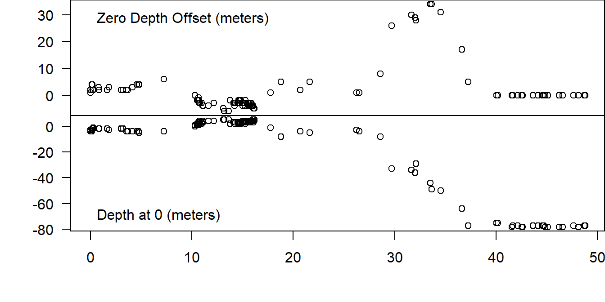
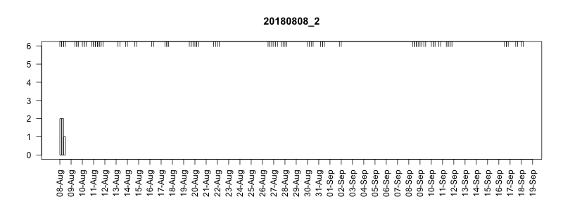

# Failure modes {#failures}

## Uncontrolled pressure transducer drift

Most folks say that when pressure transducers fail they fail completely. For some reason in the SPLASH10 tags uncontrolled drift is far more common.

### Diagnosis

If there are sufficient status messages, uncontrolled drift should be visible in the **Depth** field (see Fig. \@ref(fig:excessive-drift)). Various cutoffs have been suggested. One proposed cutoff is if more than one **Depth** value exceeds +/- 10 meters [@baird_report2018]. Wildlife Computers technical staff felt this was arbitrary and since the tags were calibrated to 1% of full scale we should use this as a cut off.

Another possible way to diagnose pressure transducer drift in the absence of a good record of status messages would be to identify very unlikely dives based on average vertical velocity (see Fig. \@ref(fig:vrate)). @baird_report2018 suggests 2 m/s as a threshold to flag a dive as potentially unlikely based on time depth data [@baird2008]. See also @tyack2006 for vertical velocities derived from DTAG data. Once flagged a decision rule would still be needed to determine what constituted a failure [e.g., @shearer2019]^[https://osf.io/3fe5k/]. 

### Examples

Note that in Fig. \@ref(fig:excessive-drift) that while the Zero Depth Offset attempts correction for a period of time, it then drops back once the drift has surpassed about 35 meters or so. In addition, the measurement of the drift also appears to pin at about 80 meters.


```r
load("examples/ex_fail_tags_status.RData")
sta1 <- sta[sta$DeployID == "exfail_2", ]
days_since_deploy <- (sta1$Received - sta1$Received[1]) / 60 / 60 /24

par(mfrow = c(2, 1), mar = c(0, 4.1, 0, 0), oma = c(4.1, 0, 0, 0))
plot(days_since_deploy, sta1$ZeroDepthOffset,
  las = 1, xlab = "", ylab = "",
  xaxt = 'n'
)
legend("topleft", legend = "Zero Depth Offset (meters)", bty = 'n')

plot(days_since_deploy, sta1$Depth,
  las = 1, xlab = "days since deployment", ylab = ""
)
legend("bottomleft", legend = "Depth at 0 (meters)", bty = 'n')
```

<div class="figure">

<p class="caption">(\#fig:excessive-drift)Excessive pressure transducer drift on a SPLASH10 tag commences at approximately 25 days after deployment.</p>
</div>

In Fig. \@ref(fig:vrate), you can see biologically impossible vertical velocities would be necessary to complete the recorded dives. It is not immediately clear if this is indeed due to excessive pressure drift or the more typical type of failure where a pressure sensor might pin to a certain value or rapidly read 0 and full scale in succession. It is also possible that both failure modes are present in this data. Nevertheless, a failure is apparent here, and could be systematical screened for if a vertical velocity threshold were selected.


```r
load("examples/ex_vrate_tag_beh.Rdata")
dur <- (beh$DurationMax + beh$DurationMin) / 2
dep <- (beh$DepthMax + beh$DepthMax) / 2
vrate <- dep * 2 / dur 
days_since_deploy <- (beh$End - beh$End[1]) / 60 / 60 / 24

plot(days_since_deploy, vrate,
  las = 1, xlab = "days since deployment", ylab = "vertical velocity (m/s)"
)
```

<div class="figure">

<p class="caption">(\#fig:vrate)An extreme example of unrealistic vertical velocities on a SPLASH10 tag suggesting pressure transducer failure</p>
</div>

### Remedy

One proposed remedy when using status messages is to truncate dive data from a tag at the last good status message before a drift threshold was crossed. Note that in some cases dive durations may still be OK if start and end of dives are defined by the conductivity sensor. In these cases as long as drift does not interfere with any of dive qualification requirements (e.g., minimum depth), durations should be accurate even when depths are not.

## Pressure transducer drift with recovery

This is a bizarre failure. Wildlife Computers technical staff was unable to provide a possible explanation.

### Example


```r
sta2 <- sta[sta$DeployID == "exfail_1", ]
days_since_deploy <- (sta2$Received - sta2$Received[1]) / 60 / 60 / 24

par(mfrow = c(2, 1), mar = c(0, 4.1, 0, 0), oma = c(4.1, 0, 1.1, 0))
# divide by two to convert from counts --> meters
plot(days_since_deploy, sta2$ZeroDepthOffset/2,
  las = 1, xlab = "", ylab = "",
  xaxt = 'n'
)
legend("topright", legend = "Zero Depth Offset (meters)", bty = 'n')

plot(days_since_deploy, sta2$Depth,
  las = 1, xlab = "days since deployment", ylab = ""
)
legend("bottomright", legend = "Depth at 0 (meters)", bty = 'n')
```

<div class="figure">

<p class="caption">(\#fig:drift-recover)Pressure transduer drift on a SPLASH10 tag followed by apparent recovery.</p>
</div>

## Unexpected resetting

Another bizarre failure. Difficult to diagnose (see below) without recovering the tag. Apparently the tag shuts off and turns back on. This appears to clear any messages in the buffer waiting to be transmitted, but the initial configuration and settings are retained. If there is a duty cycle that is initially on for a given number of days, this count appears to be restarted as well.

### Diagnosis

Wildlife Computers technical staff suggested one of our tags might be resetting based on a pattern of alternating high and low depth readings in the series data stream (Fig. \@ref(fig:reset-ser)).

In addition, I noticed the following (see Fig. \@ref(fig:reset-animation1)):

- There were many more gaps in the data stream than for tags deployed at the same time, even though the deployment placement was good.
- The tag was apparently ignoring its duty cycle.
- After a gap in the data, new data previous to the gap never arrived at the satellites (suggesting that the buffer had been lost somehow).

### Examples


```r
load("examples/ex_reset_tag_ser.RData")
plot_series(ser, 
  xaxt = 'n', las = 1, ylab = "Depth (m)", xlab = ""
)
axis(1, at = ser$Date, lab = NA, tcl = .3)
```

<div class="figure">

<p class="caption">(\#fig:reset-ser)Series data stream from a SPLASH10 during an apparent resetting event. Sampling period is 5 minutes (tick markets along x-axis)</p>
</div>

<div class="figure">

<p class="caption">(\#fig:reset-animation1)Series message arrival pattern for an apparently resetting SPLASH10 tag. Data downloaded can can be seen advancing above plot. Bars indicate how many times each series data message was received. Pink areas indicate gaps.</p>
</div>


## Conductivity sensor undersampling {#undersample}

When set to define dives, if a conductivity sensor is low on an animal or fouled it might not get dry during every surfacing especially during heavy weather. This could lead to an underestimate of numbers of surfacings. Under the BRS behavior tag setting regime (see § \@ref(behaviortags)) short surfacings and shallow dives are not being captured anyway so this might be less of an issue. There is a possibility that such undersampling could lead to multiple dives being concatenated if the conductivity sensor never read dry between.

### Diagnosis

Very hard to diagnose.

### Remedy

One possible remedy would be to use pressure as the start and end definition of a dive for behavior data. @schorr2014 compared these two methods of dive definition and found that the conductivity sensor definition was more accurate for determining ventilation periods, however if this is not a priority then a dive definition may help reduce the possibility of undersampling. One draw back to using pressure as a dive definition is that all dive data must be considered unreliable if there is a pressure transducer failure, where when conductivity is used as a dive definition is it possible for durations to be accurate even when depths are not.

Series data does not rely on a dive definition at all and so is not subject to this type of failure.
